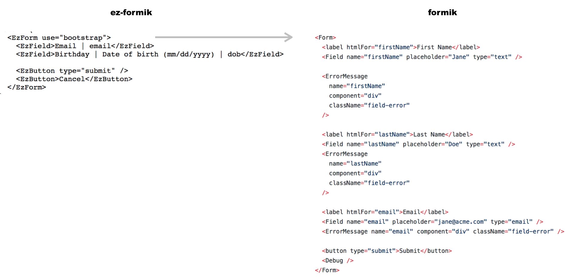
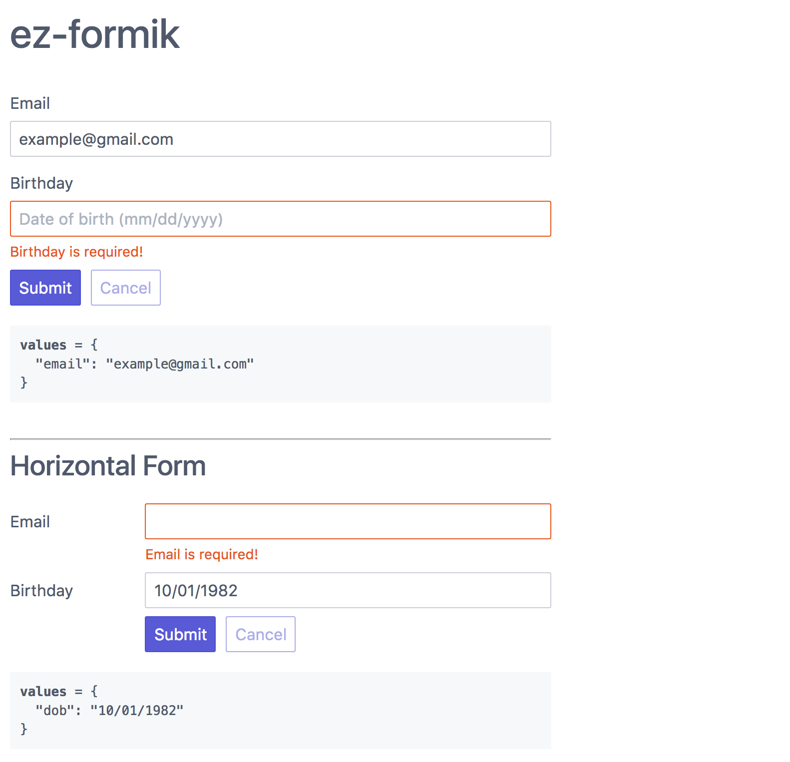

# ez-formik

[](https://travis-ci.org/ngduc/ez-formik)

Easy-to-use components to use with formik - hence the name ez-formik.

*"Let it take care of the work so you don't have to"*

- Live example: [Codesandbox](https://codesandbox.io/s/y7vwzp2091)

### 🌟 Features

[](src/EzFormikExample.tsx)

```
Easy    Flexible    Consistent    Fast    Layouts    Themes    More Types
```

Not just shorter syntax, it's also offering:
- Formik is easy, ez-formik is ...easier, duh `¯\_(ツ)_/¯`
- Simplified Formik but will not stand in your way. You are free to follow Formik at any point.
- Consistent rendering, stylings (for big projects)

And more:
- Layouts (vertical, horizontal)
- Work with different CSS Frameworks / Form Layouts (tentcss (default), bootstrap, spectre, etc.)
- Use FastField to avoid too many re-renders.
- More types of fields.

### 📦 Usage

```JS
$ npm install ez-formik

import { EzField, EzSubmit } from 'ez-formik';

<EzForm use="bootstrap">
  <EzField>Email | email</EzField>
  <EzField>Birthday | Date of birth (mm/dd/yyyy) | dob</EzField>

  <EzButton type="submit" />
  <EzButton>Cancel</EzButton>
</EzForm>
```
- Full code example: [Link](src/EzFormikExample.tsx)
- Live example: [Codesandbox](https://codesandbox.io/s/y7vwzp2091)

Result:

[](src/EzFormikExample.tsx)

### 📖 Documentation

[Change Log](/CHANGELOG.md)

### 🙌 Thanks

All contributions are welcome!