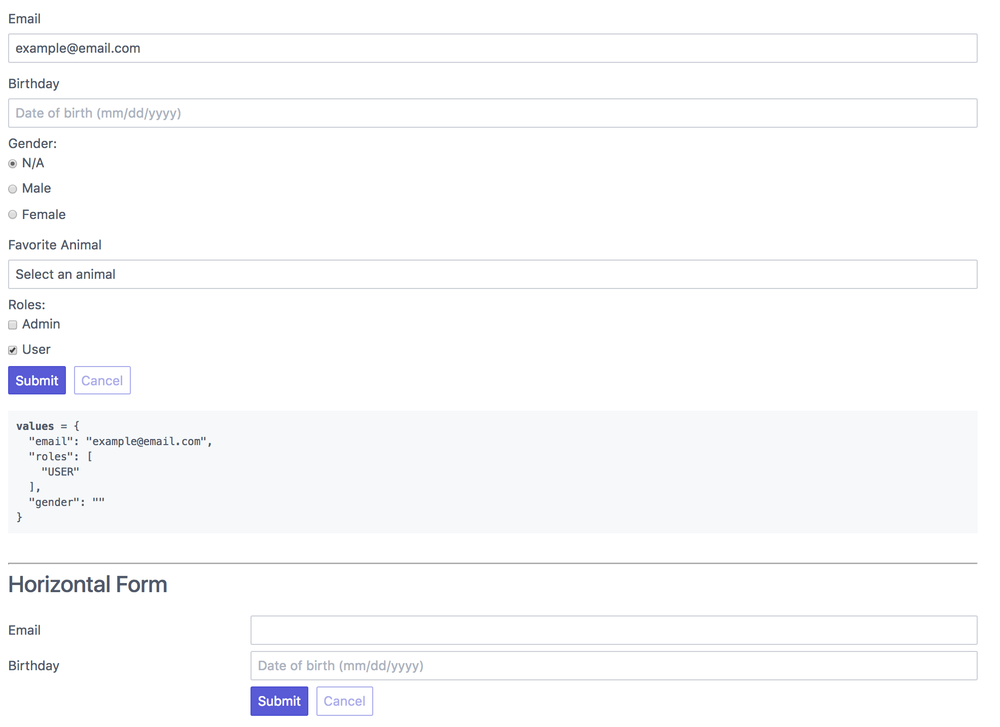

# ez-formik

Easy-to-use components to use with formik - hence the name ez-formik.

### 🌟 Features

- Formik is easy, ez-formik is ...easier.
- Simplify Formik usage but doesn't change it completely. You are still free to follow Formik at any point.

### 📦 Usage

```JS
$ npm install ez-formik

import { EzField } from 'ez-formik';

<Form>
  <EzField>Label | Placeholder (optional) | field</EzField>
  <EzField>Birthday | Date of birth (mm/dd/yyyy) | dob</EzField>
  <EzSubmit />
</Form>
```

Result:

[](src/EzFormikExample.tsx)

### 📖 Documentation

[Change Log](/CHANGELOG.md)

### 🙌 Thanks

All contributions are welcome!